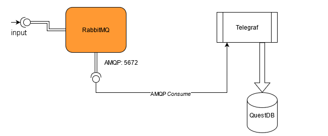

# rabbiTMQuest
RabbitMQ + Telegraf + QuestDB Stack for AMQP Comsomer Systems

## Architecture

### Components

1. [RabbitMQ Message Broker](https://www.rabbitmq.com/): A powerful messaging broker that can _broker_ with a lot of well-known Protocols namely __MQTT__, __AMQP__, __STOMP__ etc.

2. [Telegraf](https://www.influxdata.com/time-series-platform/telegraf/): A powerful agent to help collect metrics. A software _Swiss-Knife_.

3. [QuestDB](https://questdb.io): A Blazing Fast Time-Series Database that queries and processes data before you could say rabbitMQuest.

### AMQP Bridging

> Consume with AMQP and no need to write exclusive services / scripts to store it into _QuestDB_

## Usage

The Repository provides the __rabbiTMQuest__ Stack with basic security

| Stack Name          | Security               |
|:-------------------:|------------------------|
| `prototype`         | basic level passwords  |

__NOTE__: refer to `prototype` directory since it has its own `README.md` and SHOULD be referred to for initial configuration / customization

### Commands

    docker-compose -f prototype/docker-compose.prototype.yml up

## License
__MIT License__

## Contributing
Please use __GitHub Issues__ for queries, bugs etc. and feel free to open Pull-Requests for improvements, bug fixes etc.
